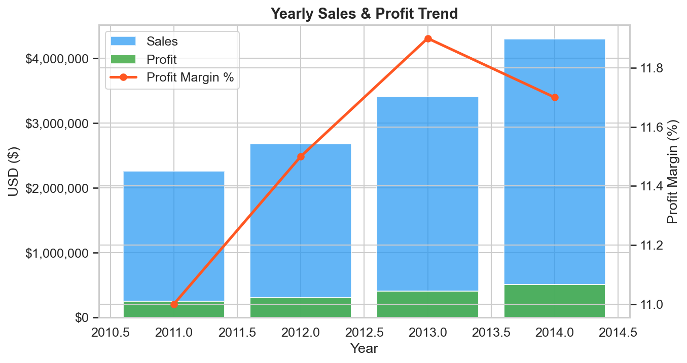
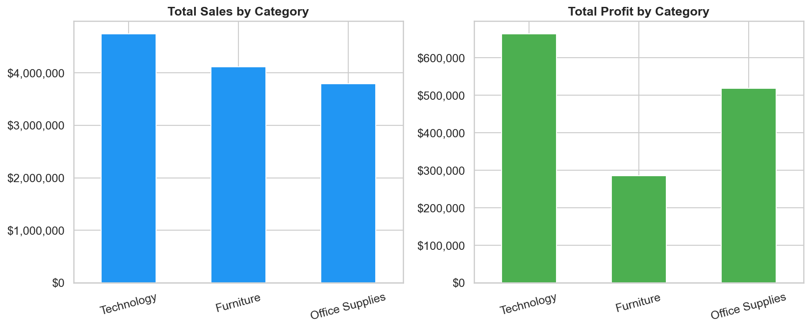
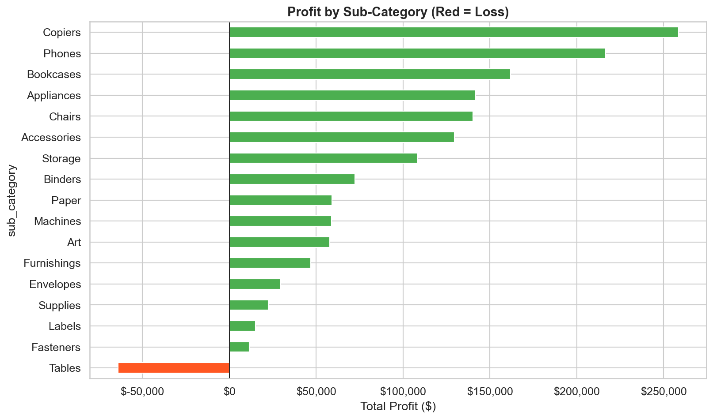
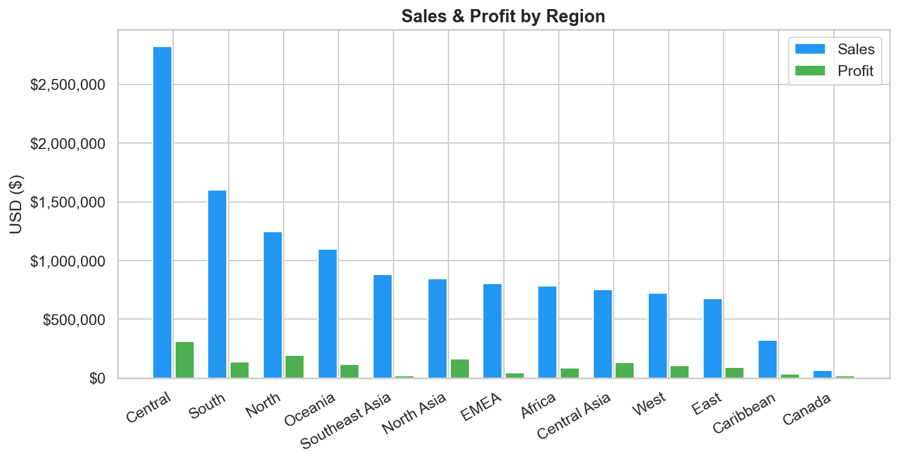
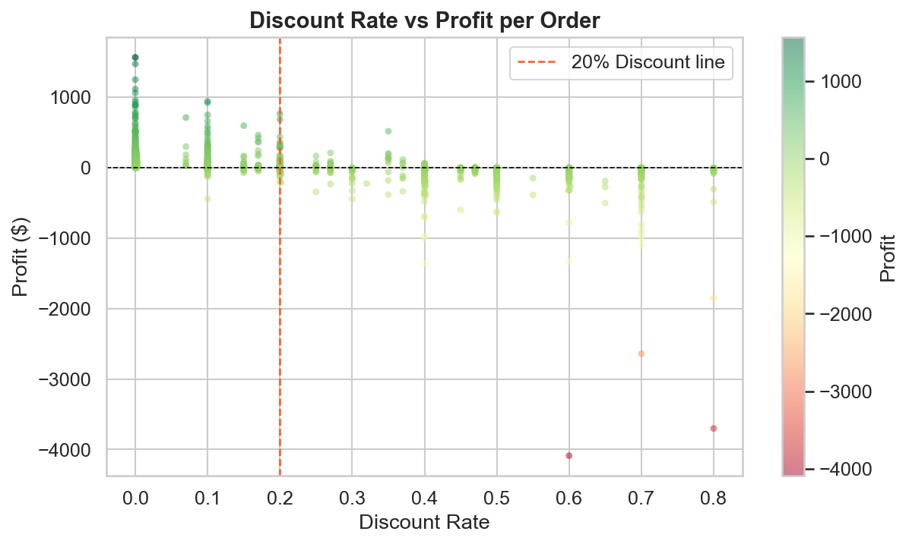
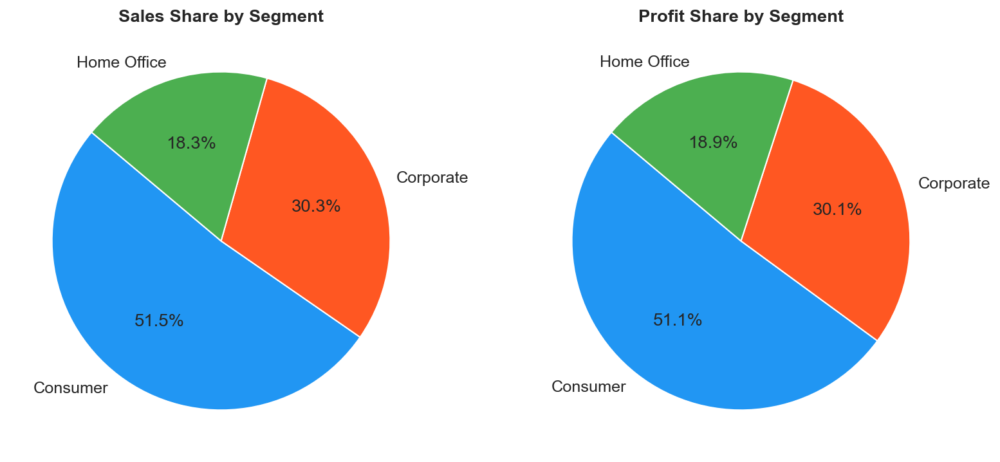
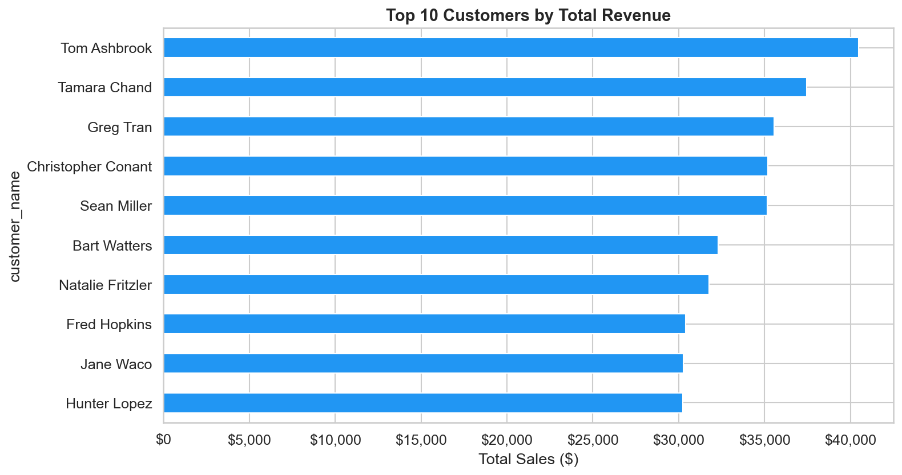
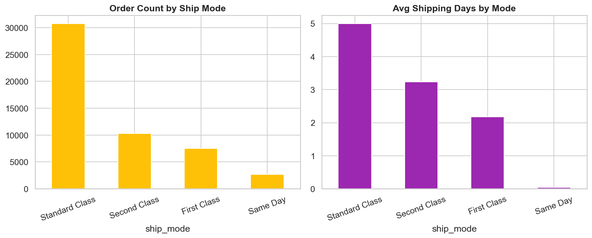
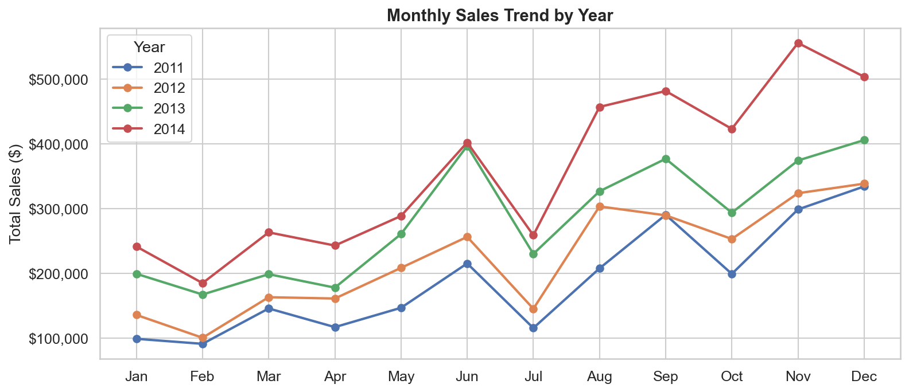
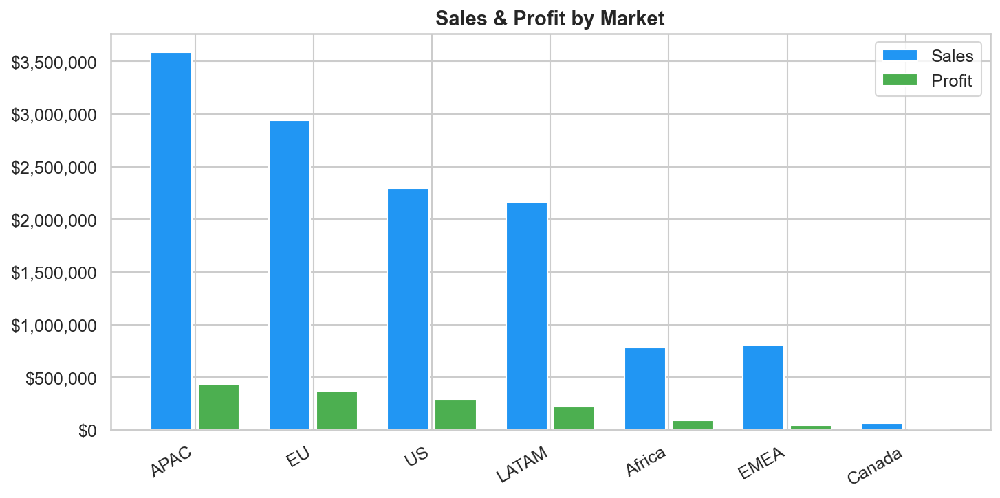

# E-Commerce Sales & Customer Analytics Dashboard

> A complete end-to-end Data Analytics project built on the Global Superstore dataset.  
> Covers data cleaning, SQL analysis, Python EDA, visualisation, and business recommendations.

---

## Business Problem

GlobalMart's management needed to understand:
- Why profit margins are inconsistent across regions and categories
- Whether discounts are helping or hurting the business
- Which customers and products drive the most value
- How to prioritise decisions for the next financial year

---

## Key Numbers at a Glance

| Metric | Value |
|---|---|
| Total Revenue (2011–2014) | $12.6 Million |
| Total Profit | $1.47 Million |
| Overall Profit Margin | 11.7% |
| Total Orders Analysed | 51,290 |
| Global Markets Covered | 7 |
| Product Categories | 3 |
| Sub-Categories | 17 |
| Unique Customers | 1,590+ |

---

## Dataset

| Property | Value |
|---|---|
| Source | Global Superstore Dataset |
| Rows | 51,290 |
| Columns | 27 (24 after cleaning) |
| Date Range | 2011–2014 |
| Markets | US, EU, APAC, LATAM, Africa, EMEA, Canada |

---

## Tech Stack

| Tool | Purpose |
|---|---|
| Python 3.10 | Data cleaning, EDA, visualisation |
| Pandas | Data manipulation and transformation |
| NumPy | Numerical operations |
| Matplotlib / Seaborn | Charts and graphs |
| MySQL | SQL analysis (25 queries) |
| Power BI | Interactive dashboard |
| Git / GitHub | Version control and portfolio hosting |

---

## Charts & Visualisations

### 1. Yearly Sales & Profit Trend
Sales grew from $2.26M in 2011 to $4.30M in 2014 — nearly doubled in 4 years.



---

### 2. Sales & Profit by Category
Technology leads in profit. Furniture sells a lot but barely makes money.



---

### 3. Profit by Sub-Category
Tables have **-$64,083 profit** — being sold at a loss due to excessive discounting.



---

### 4. Regional Performance
Canada has the highest margin (26.6%). Southeast Asia barely breaks even at 2%.



---

### 5. Discount vs Profit
Orders with discounts above 20% consistently result in **negative profit margins**.



---

### 6. Customer Segment Analysis
Consumer segment is largest. All segments maintain ~11.5–12% profit margin.



---

### 7. Top 10 Customers by Revenue
Tom Ashbrook leads at $40,489. Sean Miller is top 10 by sales but **negative profit**.



---

### 8. Shipping Mode Analysis
Standard Class handles 60% of all orders. Same Day is most expensive per order.



---

### 9. Monthly Sales Trend
Clear Q4 spike every year — holiday seasonality confirmed across all 4 years.



---

### 10. Market Performance (Global)
APAC is the biggest market. EMEA underperforms at only 5.4% profit margin.



---

## Key Insights

1. **Tables are being sold at a loss** — average discount of 30%+ results in -$64K profit
2. **Technology has the highest profit margin** (~14%) and is the most valuable category
3. **Discounts above 20% always result in negative margin** — the 31%+ bracket averages -51.3%
4. **Top 20% of customers generate ~80% of revenue** — Pareto principle confirmed
5. **Q4 is peak season** — sales spike 40–60% above Q1/Q2 average every year
6. **Southeast Asia and EMEA are underperforming** — margins of 2% and 5.4% respectively

---

## Business Recommendations

See full report: [reports/business_recommendations.md](reports/business_recommendations.md)

| # | Recommendation | Priority |
|---|---|---|
| 1 | Cap Furniture discounts at maximum 10% | Critical |
| 2 | Increase marketing investment in Technology | High |
| 3 | Audit discount practices in Central region | High |
| 4 | Set minimum order value for First Class shipping | Medium |
| 5 | Build VIP loyalty programme for top 20% customers | High |
| 6 | Launch mid-year campaign to reduce Q1/Q2 revenue dip | Medium |

---

## Project Structure

```
project/
│
├── data/
│   ├── superstore.csv              ← Raw data (original, never modified)
│   └── superstore_clean.csv        ← Cleaned data ready for analysis
│
├── sql/
│   └── superstore_analysis.sql     ← 25 SQL queries: Basic → Window Functions
│
├── notebooks/
│   ├── 01_data_cleaning.py         ← Data cleaning & feature engineering
│   └── 02_eda.py                   ← 10 EDA analyses with charts
│
├── dashboard/
│   └── superstore_dashboard.pbix   ← Power BI dashboard file
│
├── reports/
│   └── business_recommendations.md ← 6 key findings + recommendations
│
├── images/                         ← 10 charts generated from real data
│
├── docs/
│   ├── powerbi_setup_guide.md      ← Step-by-step Power BI build guide
│   └── resume_and_interview.md     ← Resume bullets + interview prep
│
├── README.md
├── requirements.txt
└── .gitignore
```

---

## How to Run This Project

### Step 1 — Clone the repository
```bash
git clone https://github.com/YOUR_USERNAME/ecommerce-sales-analytics.git
cd ecommerce-sales-analytics
```

### Step 2 — Install dependencies
```bash
pip install -r requirements.txt
```

### Step 3 — Run data cleaning
```bash
python3.10 notebooks/01_data_cleaning.py
```

### Step 4 — Run EDA and generate all charts
```bash
python3.10 notebooks/02_eda.py
```

### Step 5 — SQL Analysis
- Open MySQL Workbench
- Create database: `superstore`
- Import `data/superstore_clean.csv` as table `orders`
- Open and run `sql/superstore_analysis.sql`

### Step 6 — Power BI Dashboard
- Follow the guide in `docs/powerbi_setup_guide.md`
- Connect `data/superstore_clean.csv` as the data source

---

## Skills Demonstrated

- Data Cleaning & Feature Engineering with Pandas
- SQL from basic SELECT to advanced Window Functions (RANK, DENSE_RANK, Running Totals, Moving Averages)
- Exploratory Data Analysis with real business context
- Data Visualisation — chart selection, colour theory, business storytelling
- Business Recommendations — translating data into actionable decisions
- Power BI — data modelling, DAX measures, interactive dashboard design
- Professional project documentation for portfolio and GitHub

---

## SQL Concepts Covered

| Level | Concepts |
|---|---|
| Beginner | SELECT, WHERE, ORDER BY, GROUP BY, HAVING |
| Intermediate | CASE, JOINs, Subqueries, Views |
| Advanced | CTEs, Window Functions, RANK, DENSE_RANK, ROW_NUMBER, Running Totals, Moving Averages, Date Functions |

---

## Author

**Shireen**  
Data Analytics Portfolio Project  
Built using Python, SQL, Matplotlib, and Power BI on real e-commerce data.

---

*If you found this project useful, feel free to star the repository.*
